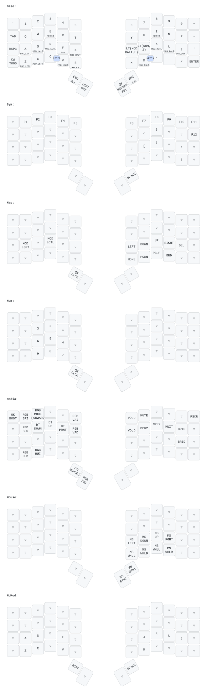

# My QMK keymap

Built as an [external userspace](https://docs.qmk.fm/newbs_external_userspace).

## Layout



### Generating the layout images

The layout images were generated with [keymap-drawer](https://github.com/caksoylar/keymap-drawer).
The images are from the voyager layout. My Moonlander layout is a copy of it anyway.
To generate the images, you first need to convert the QMK keymap from c to JSON, and then from JSON to YAML:

```bash
qmk c2json keyboards/zsa/voyager/keymaps/vandalt/keymap.c | keymap parse --layer-names Base Sym Nav Mouse NoMod -c 10 -q - > assets/voyager_keymap.yaml
```

The SVG image can then be generated with

```bash
keymap draw assets/voyager_keymap.yaml > voyager_keymap.ortho.svg
```

## Compiling and flashing

To compile and flash the keymap, use

```bash
qmk compile -kb zsa/voyager -km vandalt
qmk flash -kb zsa/voyager -km vandalt
```

To compile both at once, simply use `qmk compile` without any arguments.

## Keyboards

I have configs for the ZSA Moonlander and ZSA Voyager.
Both were originally built with Oryx and edited so they would compile with the latest QMK.

I am aiming to put most of the configuration in a [userspace](https://docs.qmk.fm/feature_userspace) so that it is shared between the two keyboards.

Merging config files is fairly simple.
Merging the keymaps requires a bit more work. See <https://github.com/drashna/qmk_userspace/tree/master> and <https://github.com/getreuer/qmk-keymap>.
